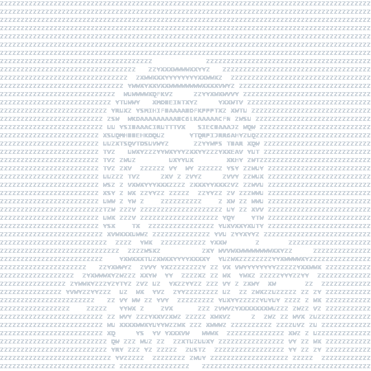

  

 

  

---

  

<picture>
  <source media="(prefers-color-scheme: dark)" srcset="https://raw.githubusercontent.com/zabbarfalih/zabbarfalih/output/github-contribution-grid-snake-dark.svg" />
  <source media="(prefers-color-scheme: light)" srcset="https://raw.githubusercontent.com/zabbarfalih/zabbarfalih/output/github-contribution-grid-snake.svg" />
  
</picture>

---

  

  <picture>
    <source media="(prefers-color-scheme: dark)" srcset="https://github-readme-stats-fast-ten-omega.vercel.app/api?username=zabbarfalih&show_icons=true&include_all_commits=true&hide=contribs&theme=dracula" />
    <source media="(prefers-color-scheme: light)" srcset="https://github-readme-stats-fast-ten-omega.vercel.app/api?username=zabbarfalih&show_icons=true&include_all_commits=true&hide=contribs&theme=default" />
    
  </picture>
  <picture>
    <source media="(prefers-color-scheme: dark)" srcset="https://github-readme-stats-fast-ten-omega.vercel.app/api/streak?username=zabbarfalih&theme=dracula" />
    <source media="(prefers-color-scheme: light)" srcset="https://github-readme-stats-fast-ten-omega.vercel.app/api/streak?username=zabbarfalih&theme=default" />
    
  </picture>

  <picture>
    <source media="(prefers-color-scheme: dark)" srcset="https://github-readme-stats-fast-ten-omega.vercel.app/api/top-langs/?username=zabbarfalih&layout=compact&langs_count=20&card_width=800&theme=dracula" />
    <source media="(prefers-color-scheme: light)" srcset="https://github-readme-stats-fast-ten-omega.vercel.app/api/top-langs/?username=zabbarfalih&layout=compact&langs_count=20&card_width=800&theme=default" />
    
  </picture>

---

  

  

  

**Languages**
 

**Frontend**
 

**Backend**
 

**Database & Big Data**
 

**DevOps & Tools**
 

**CMS & Platforms**
 

  

  

**Web Security**
 

**Network Pentest**
 

**Recon & Enumeration**
 

**Exploitation Tools**
 

  

  

**Analysis & ML**
 

**Big Data**
 

**Statistics & Tools**
 

**Geospatial**
 

---

  

  

